theme: Poster
slidenumbers: true
slide-transition: fade(0.3)

> There are only two hard things in Computer Science: cache invalidation and naming things.

-- Phil Karlton

---

> There are 2 hard problems in computer science: cache invalidation, naming things, and off-by-1 errors.

-- Leon Bambrick

---

> there's two hard problems in computer science: we only have one joke and it's not funny.

-- @pbowden

---

## Level up Your Git Commits with Gitmoji! 👍🏻

---

# Practicing Gitmoji ~~will~~ _may_ help you get better at naming things

---

# Overview

- Emoji Primer
- Gitmoji
  - Tour
- Theory
- Best Practices
- Tools

---

# Emoji

a standardised set of characters that is available on iOS, Android, Windows and macOS.
While the artwork for each emoji character varies by platform, the meaning of each symbol remains the same.

---

# Emoji Primer

## 💩

- name: Pile of Poop
- Unicode codepoint: U+1F4A9

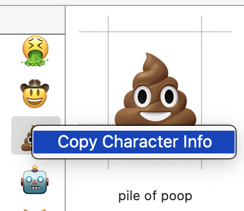

- shortcode: `:poop:`
- https://emojipedia.org/pile-of-poo/

^ shortcode is plain text which is rendered using an emoji icon
^ emojipedia is a great place to review emoji details
^ different platforms/apps show different icons

---

# Emoji Versions

- Unicode 6.0 (2010)
- Unicode 8.0/Emoji 1.0 (2015)
- Unicode 10.0/Emoji 5.0 (2017)
- _No Emoji 6.0-10.0_
- Unicode/Emoji 11.0 (2018)
- **Unicode/[Emoji 12.0](https://emojipedia.org/emoji-12.0/)** (2019)
- Unicode/[Emoji 13.0](https://emojipedia.org/emoji-13.0/) (2020)

^ Unicode 6 was first version to include emoji
^ Now on a somewhat annual cadence
^ Emoji 13 coming in Android 11, maybe iOS 14.1, macOS 11.1

---

# 3,304 emoji in the Unicode Standard

- as of Emoji 13.0

---

# 😱

Emoji 14 will be delayed 6 months into 2022 due to COVID-19

---

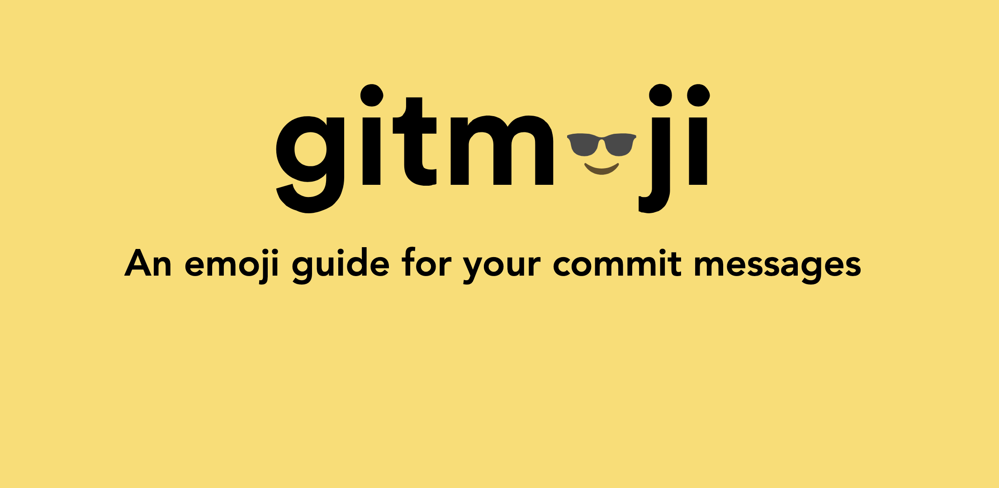

---

# Gitmoji

- git + emoji
- Created by Carlos Cuesta

^ carlos, web developer in Spain

---

# Conventional Commits

- Gitmoji is like Conventional Commits
- but more fun

https://conventionalcommits.org/en/v1.0.0/

```
feat: allow provided config object to extend other configs
BREAKING CHANGE: `extends` key in config file is now used for extending other config files
refactor!: drop support for Node 6
fix: correct minor typos in code
docs: correct spelling of CHANGELOG
```

---

# Inspired by Atom

[CONTRIBUTING.md#git-commit-messages](https://github.com/atom/atom/blob/master/CONTRIBUTING.md#git-commit-messages)

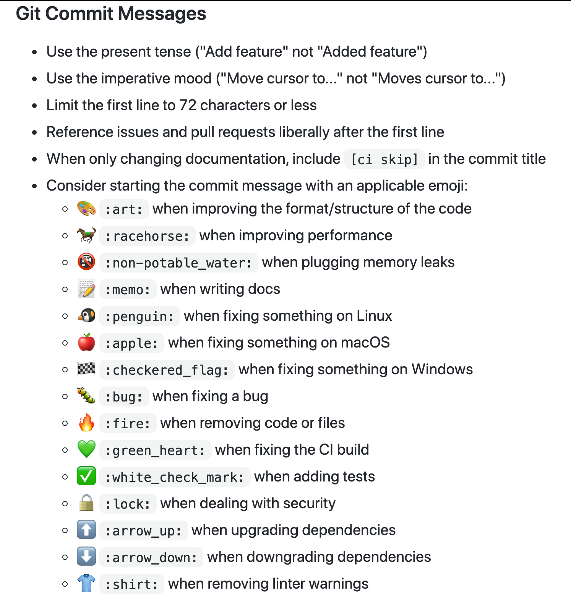

^ contribution guidelines

---

# Examples

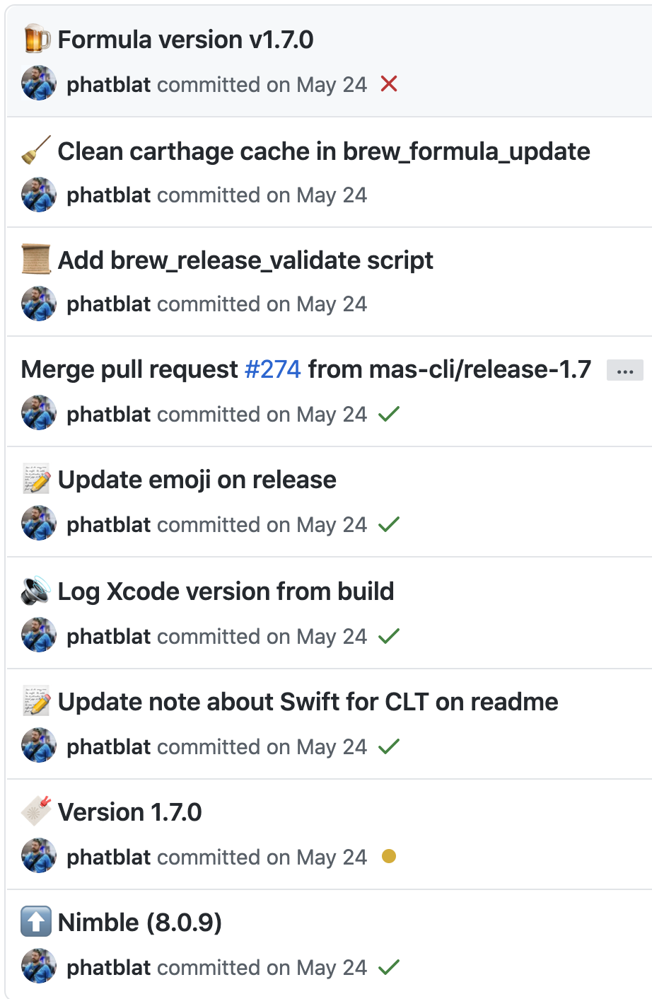

---

# Gitmoji Tour

^ Built for JavaScript web projects

---

# 🎉

## `:tada:`

- Begin a project

^ first commit
^ called "party popper"

---

# ✨

## `:sparkles:`

- Introducing new features

---

# 🐛

## `:bug:`

- Fixing a bug

---

# ✅

## `:white_check_mark:`

- Adding or updating tests

---

# ⬆️

## `:arrow_up:`

- Upgrading dependencies

---

# 🚨

## `:rotating_light:`

- Removing linter warnings

---

# 💄

## `:lipstick:`

- Adding or updating UI and style files

---

# 🔥

## `:fire:`

- Removing code or files

---

# 🎨

## `:art:`

- Improving structure or format of code

---

# 💥

## `:boom:`

- Introducing breaking changes

---

# 🔖

## `:bookmark:`

- Release/version tags

^ use this for the commit where you updated an app/library version

---

# 👷🏻‍♀️

## `:construction_worker:`

- Adding or updating CI build system

---

# 🔧

## `:wrench:`

- Adding or updating configuration files

---

# 🛠

## `:hammer_and_wrench:`

- Adding or updating **Xcode** configuration files

*This is a @phatblat™️ suggestion for Apple devs

---

# Get all that? 🤯

---

# What does this have to do with naming things?

---

# Brain Exercise 🧠

- Executive Function
- Decision-making

^ Gitmoji is an extra talk to exercise your brain a bit differently

---

# Executive Function

an umbrella term for the neurologically-based skills involving mental control and self-regulation.

- Working memory
- Mental flexibility
- Self-control
- Self-monitoring
- Planning and problem solving

^ covers more than this list but these are what apply to this talk

---

# Working memory

governs our ability to retain and manipulate distinct pieces of information over short periods of time.

^ remembering what you just did and why

---

# Mental flexibility

helps us to sustain or shift attention in response to different demands or to apply different rules in different settings.

- writing code vs crafting commit message
- **abstraction!**

^ abstraction is key to communication and building bigger things, reusable code
^ those with autism have trouble with this

---

# Self-control

enables us to set priorities and resist impulsive actions or responses.

^ resisting the urge to make changes outside the scope of your current focus

---

# Self-monitoring

keeping track of what you’re doing

^ including your actions in memory

---

# Planning

thinking ahead of what type of changes you are going to a project

^ perhaps the commit messsage could help you decide what you're going to change

---

# Problem solving

process of investigating the given information and finding all possible solutions through invention or discovery

^ you are all probably good at problem solving

---

# Decision-making

actions taken to solve a problem

- choosing a name for a variable, method or type
- choosing an emoji to include in your commit message

^ don't get stuck in analysis paralysis
^ if it's hard, maybe the scope is too big

---

# TL;DR

it makes you think more about your commit messages and contents

---

# Gitmoji Best Practices

---

# One emoji per commit message

- Like a label
- Wanting to cram more emoji is a sign that your commit may not be focused
- 🚑 > 🐛

^ some emoji are similar but trump each other
^ ambulance is a type of bug

---

# Experiment, but be consistent within the project

- no need to use platform emoji on a single-platform project

---

# Tools

- gitmoji
- macOS Character Picker
- Karabiner-Elements
- Rocket

---

# Online Cheatsheet

- https://gitmoji.carloscuesta.me/

---

# Gitmoji Install

`npm i -g gitmoji-cli`

---

# Gitmoji List

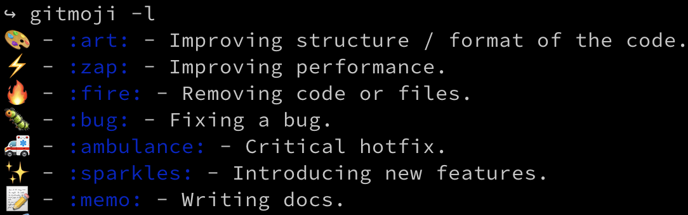

---

# Gitmoji Search

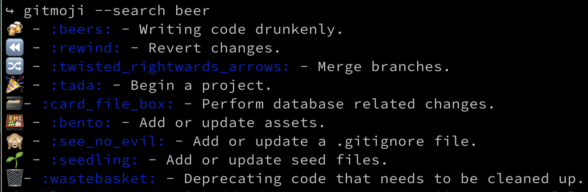

---

# Gitmoji Commit

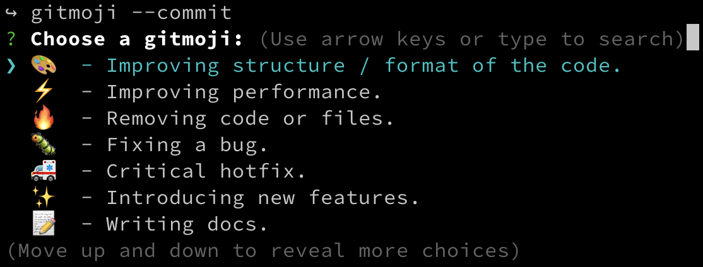

^ interactive emoji search

---

# Gitmoji Commit 2

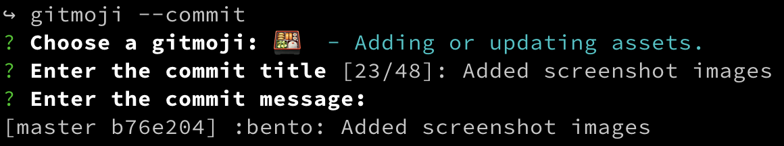

^ interactive commit message

---

## macOS Character Viewer

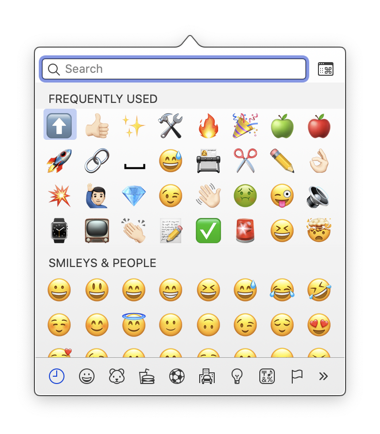

# ^ + ⌘ + ⎵

^ control-command-space is the macOS system shortcut for Character Viewer
^ up to 32 most frequently used symbols
^ 🎉 is party popper, not :tada:
^ click the button in upper-right corner expands sheet to full Character Viewer window

---

# Karabiner-Elements

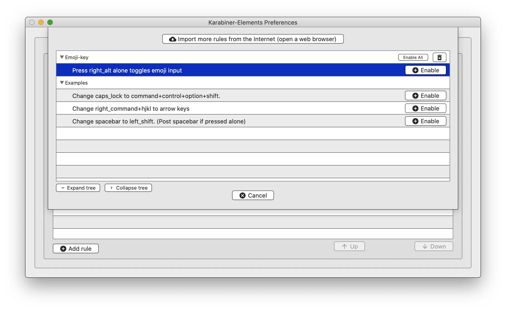

^ open source

---

# Programmable Keyboard

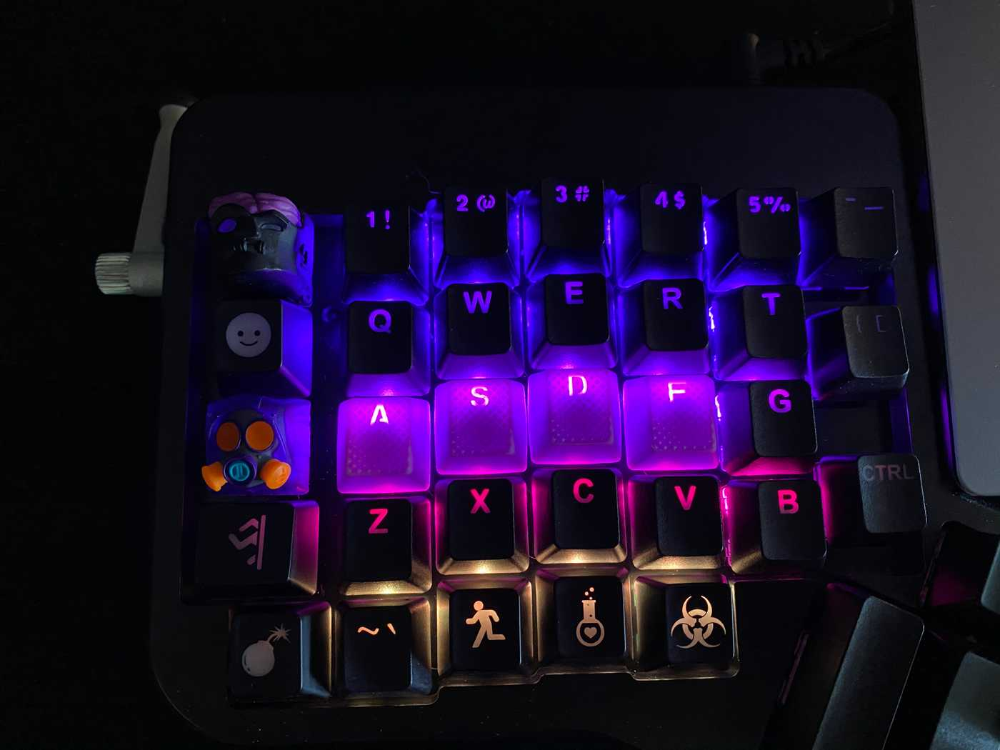

^ ErgoDox EZ programmable mechanical keyboard

---

# Rocket 🚀

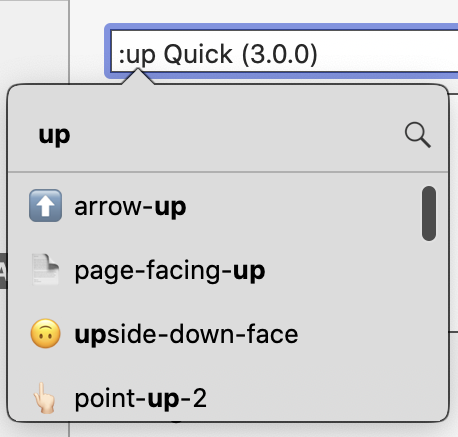

https://matthewpalmer.net/rocket/

^ slack-style emoji picker
^ free download
^ $5 pro features, like custom aliases

---

# Go forth and gitmojify thine commits!

---

# References

- [What the 2021 Unicode Delay Means for Emoji Updates](https://blog.emojipedia.org/what-the-2021-unicode-delay-means-for-emoji/)
- [Gitmoji](https://gitmoji.carloscuesta.me/)
- [GitHub emoji shortcodes](https://emojipedia.org/github/)
- [GitHub Markdown Emoji](https://gist.github.com/rxaviers/7360908)
- [Slack Emoji Short Codes](https://emojipedia.org/slack/#:~:text=Slack%20permits%20a%20set%20of,instead%20of%20the%20emoji%20character.)
- [Use emoji and symbols on Mac](https://support.apple.com/en-gb/guide/mac-help/mchlp1560/mac)

---

# References 2

- [@phatblat's keyboard setup](https://people.ergodox-ez.com/ben-chatelain/)
- [ErgoDox EZ programmable keyboards](https://ergodox-ez.com/)
- [Karabiner-Elements](https://karabiner-elements.pqrs.org/)
  - [Emoji-key](https://ke-complex-modifications.pqrs.org/json/Right_option_as_emoji_key.json)
  - [source](https://github.com/pqrs-org/Karabiner-Elements)
- [TwoHardThings](https://martinfowler.com/bliki/TwoHardThings.html) by Martin Fowler
- [Executive functions](https://en.wikipedia.org/wiki/Executive_functions)
