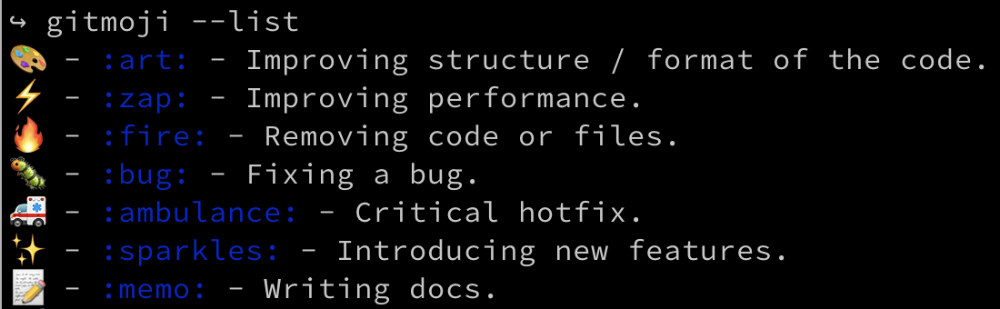

theme: Poster
slidenumbers: true
slide-transition: fade(0.3)

## Level up Your Git Commits with Gitmoji! 👍🏻

---

# Overview

- Theory
- Practice
- Tools

---

# Tools

- gitmoji
- macOS Character Picker
- Karabiner-Elements
- Rocket

---

# Gitmoji List

---

# Gitmoji Search

---

# Gitmoji Commit

^
- interactive emoji search

---

# Gitmoji Commit

^
- interactive commit message

---

## macOS Character Viewer

# ^ + ⌘ + ⎵

^
- control-command-space is the macOS system shortcut for Character Viewer
- up to 32 most frequently used symbols

---

# Karabiner-Elements

^

- open source

---

# Programmable Keyboard

^
- ErgoDox EZ
- programmable mechanical keyboard

---

# Rocket 🚀

https://matthewpalmer.net/rocket/

^
- slack-style emoji picker
- free download
- $5 pro features, like custom aliases

---

# References

- [Use emoji and symbols on Mac](https://support.apple.com/en-gb/guide/mac-help/mchlp1560/mac)
- [@phatblat's keyboard setup](https://people.ergodox-ez.com/ben-chatelain/)
- [ErgoDox EZ programmable keyboards](https://ergodox-ez.com/)
- [Karabiner-Elements](https://karabiner-elements.pqrs.org/)
  - [Emoji-key](https://ke-complex-modifications.pqrs.org/json/Right_option_as_emoji_key.json)
  - [source](https://github.com/pqrs-org/Karabiner-Elements)
